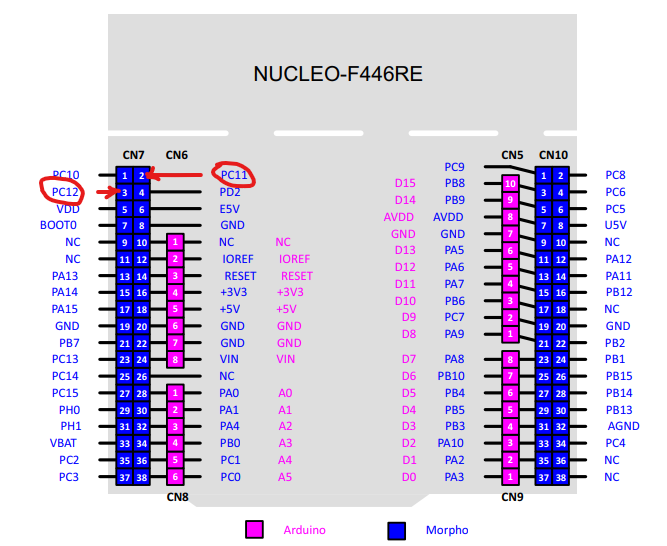

# MSOE CE4951 Networking Project

### Description
This STM32 firmware implements a network interface driver and application to interface with other devices on a shared bus compliant with the provided CE4951-STD-CSMACD-UNI-ME-002 standard.

### Connections
For this software to correctly function, its transmit and receive pins must be bridged. This software uses PC11 as the transmit pin and PC12 as the receive pin. This shared bridge node between PC11 and PC12 is the node at which the bus attached to other devices can be connected.

This software also includes a visual indicator of the state of the bus (IDLE, BUSY, COLLISION). These indicators can be seen on the pre-installed LEDs if the MSOE CE2800 devboard is used. From left to right, the LED indicators are "IDLE", "BUSY", and "COLLISION". These lights correspond to pins PB5, PB6, and PB8 on the STM32, respectively.

### Using the Application
This software implements a command line interface to sending ASCII messages to other devices. This interface can be accessed through the Nucleo-STM32F446RE Devboard's USB to UART converter, which is accessed through the MINI-USB connector on the devboard. Any serial monitor/interface program should be able to be used to interface with the device. The terminal should be set to a baud rate of 115200 and to send and receive line breaks as LF (line feed) characters.

On reset, the device should print "/* ---------- DEVICE RESET ---------- */" with two trailing line endings. 

Typing any sequence of up to 255 characters(except for the special commands) and pressing the return key will send a message on the bus once the line is detected to be idle.

### Software
- [JetBrains CLion](https://www.jetbrains.com/clion/) (this software is available for free with a [student license](https://www.jetbrains.com/community/education/#students))
- [STM32 Cube MX](https://www.st.com/en/development-tools/stm32cubemx.html)

### Resources
- [CLion + STM32 Development Environment Setup Guide](https://youtu.be/Gsje7zvYH1w)
- [MinGW + ARM GCC + OpenOCD Toolchain Download](https://drive.google.com/file/d/1OM_XLyNZpI7fyz9NIKdttNfzw98cApnO/view?usp=sharing)

### Authors
- Dan Kaehn
- Grant Wilk
- James Rector
- Luke Schlavensky

